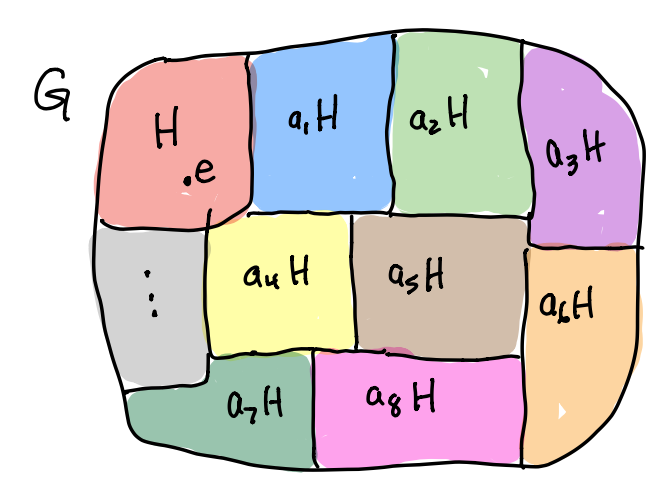
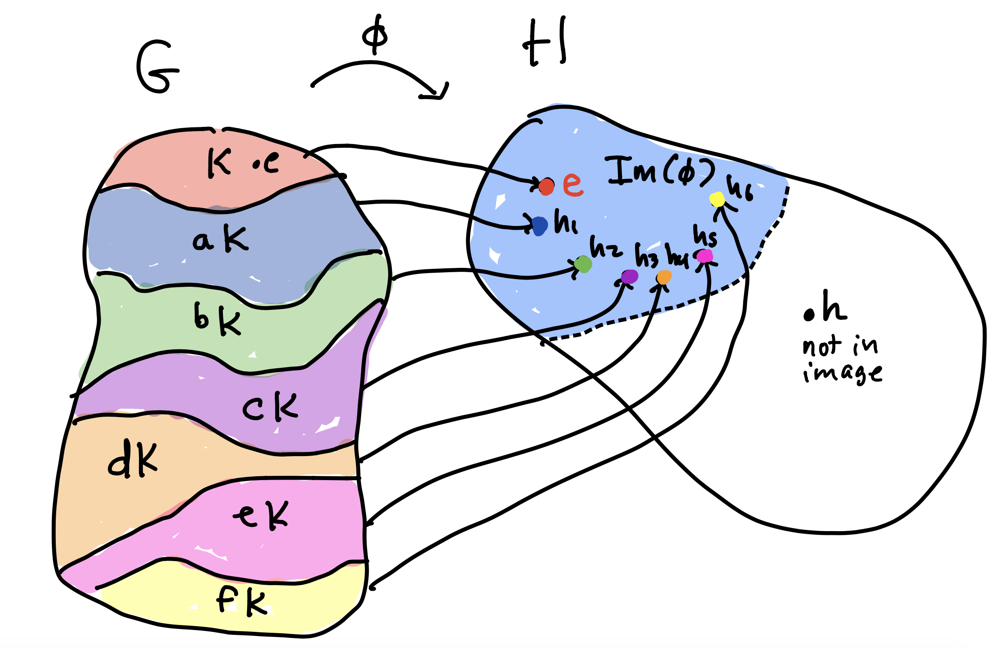

# (PART) Definitions and Theorems {-}

\newcommand{\ker}{\mathsf{Ker}}
\newcommand{\im}{\mathsf{Im}}
\newcommand{\K}{\mathsf{K}}

# Group Basics

## Groups

**Def**: A **group** is a set $\G$ with a binary operation $\ast$ that satisfies the following:

a. (Identity) There exists $e \in \G$ such that: if $g \in \G$, then  $e \ast g= g \ast e = g$.

b. (Inverse) If $g \in \G$, then there exists $g^{-1} \in \G$ so that $g \ast g^{-1} = g^{-1} \ast g = e$.

c. (Associativity) If $a,b,c \in \G$, then $(ab)c = a (bc)$. 

Furthermore, the group is **abelian** if it also satisfies the commutative property:

d. (Commutative) If $a,b \in \G$, then $ab = ba$.

**Proposition** (Uniqueness) Let $\G$ be a group. Then

a. $\G$ has a unique identity element $e$.

b. If $a,b,c \in \G$ and $ab = e$ and $ca = e$, then $a = c$.

b. If $g \in \G$ then t
here is a unique element $g^{-1}$ such that $g g^{-1} = g^{-1} g = e$.

**Proposition** (Cancellation) Let $\G$ be a group and $a,b,c \in \G$.

a. If $a b = a c$ then $b = c$.
b. If $b a = c a$ then $b = c$.

**Proposition** ($ax =b$) Let $\G$ be a group and $a,b \in \G$.

a. The equation $a x = b$ has a unique solution $x = a^{-1} b$.
b. The equation $x a = b$ has a unique solution $x = b a^{-1}$.

**Proposition** (Latin Square) Let $\G$ be a group and $a \in \G$.

a. The function $\G \to \G$ defined by left multiplication by $a$,  $g \mapsto a g$, is one-to-one and onto.
b. The function $\G \to \G$ defined by right multiplication by $a$,  $g \mapsto g a$, is one-to-one and onto.

## Subgroups

**Def**: A *subset* $\H \subseteq \G$ of a group $\G$ is a **subgroup** if $\H$ is a group under the same binary operation that it inherits from $\G$. We write $\H \le \G$ to denote that $\H$ is a subgroup of $\G$ and write $\H < \G$ if $\H \le \G$ and $\H \not= \G$.

**Theorem**: (Subgroup Test) A *nonempty* subset $\H \subseteq \G$ is a subgroup if

a. (identity) $e \in \H$, where $e$ is the identity in $\G$.
b. (closure) If $h_1, h_2 \in \H$, then $h_1 h_2 \in \H$.
c. (contains inverses) If $h \in \H$, then $h^{-1} \in \H$.

Note: (a) follows from (b) and (c).

**Def**: The **order** of an element $g \in \G$ is the smallest positive integer $m$ such that $g^m = e$, and we write $|g| = m$. If there is no such $m$, then $|g| = \infty$.

**Def**: The **center** of a group $\G$ is the following subgroup
$$
Z(\G) = \{ a \in \G \mid \hbox{ if $g \in \G$ then $ag  = ga$ } \}.
$$

**Def**: If $g \in \G$ then $\langle g \rangle$ is the smallest subgroup of $\G$ that contains $g$. It is called the **cyclic subgroup generated by** $g$. This subgroup contains all possible powers of $g$:
$$
\langle g \rangle = \{ g^k \mid k \in \ZZ \}.
$$

## Cyclic Groups

A group $\G$ is **cyclic** if $\G = \langle g \rangle$ for some $g \in \G$.

**Theorem.** (Fundamental Theorem of Cyclic Groups) If $\G = \langle g\rangle$, then

a.  Every subgroup $\H \le \G$ is cyclic (thus, $\H = \langle g^k \rangle$).

b.  If $|g| = \infty$ then $\langle g \rangle = \{ \ldots, g^{-3}, g^{-2}, g^{-1}, 1, g, g^2, g^3, \ldots \}$ and all of these elements are distinct. 

c.  If $|g| = n$ then $\langle g \rangle = \{1, g, g^2, \ldots, g^{n-1} \}$ and all of these elements are distinct (thus, $|g| = |\langle g \rangle|$).

d.  If $|g| = n$ then  the subgroups of $\langle g \rangle$ satisfy:

    i.  $\langle g^k \rangle = \langle g^d \rangle$, where $d = \gcd(k,n)$.

    ii.  $|\langle g^k \rangle| = \frac{n}{d}= \frac{n}{\gcd(k,n)}$, which is a divisor of $n$.

    iii. If $\ell \vert n$, then $|\langle g^{n/\ell} \rangle|$ is a subgroup of size $\ell$ and is the only subgroup of size $\ell$.

Note: (d) says that, in a finite cyclic group of order $n$, there is exactly one subgroup for each divisor of $n$ and those are all the subgroups.

## Isomorphisms

**Def**: An *isomorphism* between groups $\G$ and $\H$ is a function $\phi: \G \to \H$ such that $\phi$ is \emph{one-to-one} and \emph{onto}  (a bijection) and
$$
\phi( a b) = \phi(a) \phi(b).
$$
We write $\G \cong \H$ to denote that $\G$ and $\H$ are isomorphic.

**Theorem** (Properties of Isomorphisms): if $\phi: \G \to \H$ is an isomorphism, and $g \in \G, then

a. $\phi(e_\G) = e_\H$.
a. $\phi(g^{-1}) = \phi(g)^{-1}$
a. $\phi(g^k) = \phi(g)^k$ for all $k \in \ZZ$
a. $|g| = |\phi(g)|$
a. $\phi^{-1}: \H \to \G$ is an isomorphism
a. If $K \le \G$ then $\phi(\K) \le H$ where $\phi(\K) = \{ \phi(k) \mid k \in \K \}$.
a. $|\G| = |\H|$
a. $\G$ is abelian if and only if $\H$ is abelian
a. $\G$ is cyclic if and only if $\H$ is cyclic
a. $\G$ has $k$ elements of order $m$ if and only if $\H$ has $k$ elements of order $m$.

# Group Structure

## Cosets 

**Def**: If $\H \le \G$ and $g \in \G$, then the left **coset** of $\H$ by $g$ is the set
$$
g \H = \left\{ g h \mid h \in H \right\},
$$
and the right coset of $\H$ by $g$ is the set
$$
\H g = \left\{ h g \mid h \in H \right\}.
$$

**Example**: If $\H = \{1, (123), (132)\} = \langle (123) \rangle \le \A_4$. Then the left cosets and right cosets of $\H$ are:
$$
\begin{array}{rlcrl}
\H & = \{1, (123), (132)\} &\qquad&  \H & = \{1, (123), (132)\}\\
(124) \H & = \{(124), (14)(23), (134)\}&&  
\H (124) & = \{(124), (13)(24), (243)\} \\
(142)\H & = \{(142), (234), (13)(24)\} &&
\H (142) & =\{(142), (143), (14)(23)\}\\
(143)\H & = \{(143), (12)(34), (243)\} &&
\H (143) & = \{(143), (14)(23), (142)\}\\
\end{array}
$$

**Theorem** (Properties of Cosets): If $\H \le \G$ and $a,b, \in \G$, then

a. $a \in a \H$,
b. $a \H  = \H$ if and only if $a \in \H$,
c. $a \H = b \H$ if and only if $a \in b \H$,
d. $a \H = b \H$ if and only if $b^{-1} a \in \H$,
e. $a \H \cap b \H = \emptyset$ or $a \H = b\H$,
f. $|a \H| = |b \H|$.

Parts (a) and (e) tell us that cosets **partition** the group into a set of *disjoint* subsets whose union is $\G$. Part (f) tells us that these subsets all have the *same size*. This can be pictured as:

{width=60%}

**Def**: The **index** of $\H$ in $\G$ is
$$
[\G:\H] = \#(\text{cosets of } \H \text{ in } \G).
$$
The following theorem follows immediately from the fact that the cosets partition the group and they are all the same size:

**Lagrange's Theorem**: $|\G| = |\H| [\G:\H]$.

**Corollary 1**: If $|\G|$ is finite, then $|\H|$ divides $|\G|$ (this is often written as $|\H|\, \big\vert \,|\G|)$.

**Corollary 2**: If $|\G| = p$ (prime), then the only subgroups of $\G$ are $\{e\}$ and $\G$ (i.e, $\G$ has no nontrivial, proper subgroups).

**Corollary 3**: If $g \in \G$, then $|g| = |\langle g \rangle|$ divides $|G|$.

**Corollary 4**: If $|\G|$ is finite and $g \in \G$, then $g^{|\G|} = e$.

**Corollary 5**: If $\G$ is finite and $\H \le \K \le \G$, then $[\G:\H] = [\G:\K] [\K:\H]$.

## Normal Subgroups

**Def**: A subgroup $\H \le \G$ is normal if $g \H = \H g$ for all $g \in \G$. We write $\H \trianglelefteq \G$ to indicate that $\H$ is normal in $\G$, and we write $\H \triangleleft \G$ if $\H$ is a proper normal subgroup of $\G$ (i.e. $\G \not= \H$).

**Examples:**

a. $\{e \}\trianglelefteq \G$.
b. $\G \trianglelefteq \G$.
c. If $\G$ is abelian, then every subgroup of $\G$ is normal.
d. The center $Z(\G)$ is a normal subgroup of $\G$.

**Proposition**  (Normal Subgroup Test): If $\H \le \G$ then 
$$ 
  \H \trianglelefteq \G \qquad  \text {if and only if } \qquad \text{$g h g^{-1} \in \H$ for all $g \in \G$ and all $h \in \H$}.
$$

## Quotient Groups

**Def**: $\G/\H = \{ g \H \mid g \in \G\}$ is the set of left cosets of $\H$ in $\G$. Note that
$$
\left| \frac{\G}{\H} \right| = [\G : \H] = \frac{|\G|}{|\H|},
$$
where the second equality only makes sense if $\G$ is finite.

**Def** (Coset Multiplication): If $a \H, b \H \in \G/\H$, then we define $(a \H) (b \H) = ab \H$.

**Theorem**: If $\H \trianglelefteq \G$, then coset multiplication is well-defined. That is, if $a' \in a \H$ and $b' \in b \H$, then $a' b' \H = ab \H$. This makes coset multiplication a binary operation on $\G/\H$.

Therefore, if $\H \trianglelefteq \G$, then the set of cosets $\G/\H$ forms a group under coset multiplication. Such that

a. The identity is $e \H = \H$ since $(e \H) (g \H) = e g \H = g \H$.
b. The inverse of $g \H$ is $g^{-1} \H$ since $(g \H) (g^{-1}  \H) = g g^{-1} \H = \H$.

## Homomorphisms

**Def**: If $\G$ and $\H$ are groups, then a *homomorphism* from $\G$ to $\H$ is a function $\phi: \G \to \H$ such that, if $a,b \in \G$, then
$$
\phi( a b) = \phi(a) \phi(b).
$$
**Theorem** (Properties of Homomorphisms): if $\phi: \G \to \H$ is a homomorphism, and $g \in \G,$ then

a. $\phi(e_\G) = e_\H$.
a. $\phi(g^{-1}) = \phi(g)^{-1}$
a. $\phi(g^k) = \phi(g)^k$ for all $k \in \ZZ$
a. $|\phi(g)|\, \Big\vert\, |g|$
a. If $K \le \G$ then $\phi(\K) \le H$ where $\phi(\K) = \{ \phi(k) \mid k \in \K \}$.

**Def**: if $\phi: \G \to \H$ is an homomorphism, then the **kernel** and **image** of $\phi$ are the following subsets of $\G$ and $\H$, respectively,
\begin{align*}
\ker(\phi) &= \{ g \in \G \mid \phi(g) = e_H\} \\
\im(\phi) &= \{ h \in \H \mid 
\text{there is at least one } g \in \G \text{ such that } \phi(g) = h \} \\
&= \{ \phi(g) \mid  g \in \G  \} 
\end{align*}

**Theorem**. If $\phi: \G \to \H$ is a group homomorphism, then 

a. $\ker(\phi) \trianglelefteq \G$,
b. $\im(\phi) \leq \H$.

**Proposition**. (Kernel Cosets): If $\phi: \G \to \H$ is a group homomorphism, $\K = \ker(\phi)$, and $a,b\in\G$, then
$$
a \K = b \K \quad \Leftrightarrow \quad \phi(a) = \phi(b).
$$
**Def**: If $\phi: \G \to \H$ is a group homomorphism and $h \in \H$, then the *fiber* of $h$ is the following *subset* of $\G$:
$$
\phi^{-1}(h) = \{g \in \G \mid \phi(g) = h\}.
$$
That is, these are the elements of $\G$ that map to $h$.

The previous proposition tells us:

**Corollary**: If $\phi: \G \to \H$ is a homomorphism with kernel $\K$, then

a. If $\phi(g) = h$, then $\phi^{-1}(h) = g \K,$
b. $\phi$ is $|\K|$-to-one,
c. $\phi$ is one-to-one if and only if $\K = \{e\}$.

{width=60%}

**Example**. The function $\phi: \D_{6} \to \ZZ_2 \times \ZZ_2$ given by $r \mapsto (1,0)$ and $f \mapsto (0,1)$ is a homomorphism. The fibers, and thus $\ker(\phi)$-cosets, of this function are as follows:
$$
\begin{array}{ccc}
\phi^{-1}(h) & & h \\ \hline
\K = \{ 1, r^2, r^4 \} & \mapsto & (0,0) \\
r \K = \{ r, r^3, r^5 \} & \mapsto & (1,0) \\
f \K = \{ f, r^2 f, r^4f \} & \mapsto & (0,1) \\
rf \K = \{ rf, r^3 f, r^5 f \} & \mapsto & (1,1) \\
\end{array}
$$
We see that $\D_6/\K \cong \ZZ_2 \times \ZZ_2$ as the next Theorem says in general.

**Theorem**. (First Isomorphism Theorem): If $\phi: \G \to \H$ is a group homomomorphism, then the following map is an isomorphism,
$$
\displaystyle{\frac{\G}{\ker(\phi)}}  \cong \im(\phi),
$$
and the isomorphism is given by sending the coset $a \ker(\phi)$ to $\phi(a)$.

