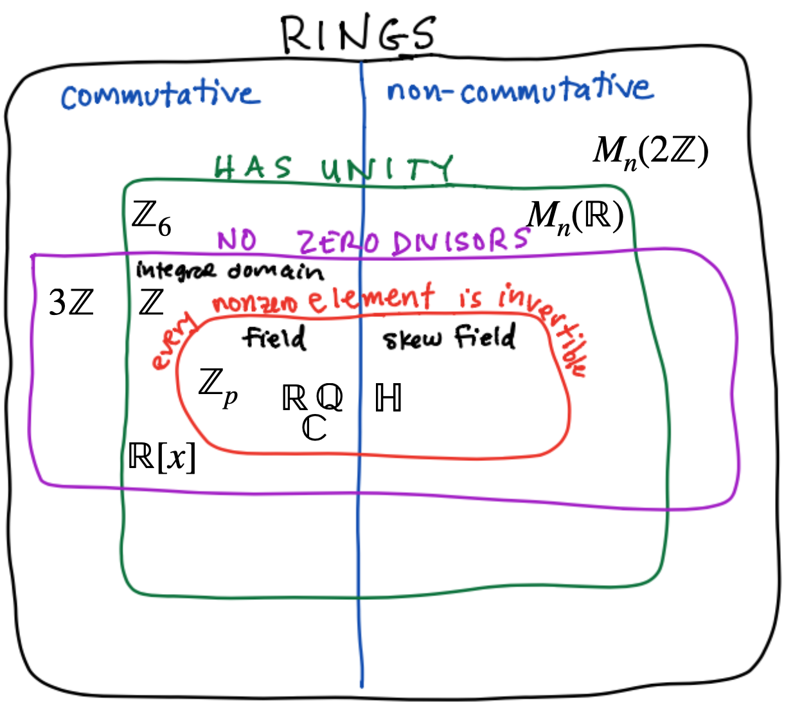

# Rings

##  Definitions

**Def**: A **ring** is a set $R$ with *two* binary operations $+$ and $\ast$ such that:

1. $R$ is an abelian group under addition. That is, 

    a. (Identity) There exists $0 \in R$ such that: if $a \in R$, then  $a + 0 = 0 + a = a$.

    b. (Inverse) If $a \in R$, then there exists $-a \in R$ so that $a + (-a) = 0$.

    c. (Associativity) If $a,b,c \in R$, then $(a+b)+c = a + (b+c)$. 

    d. (Commutative) If $a,b \in R$, then $a+b = b+a$.

2. (Associativity of product) If $a,b,c \in R$, then $(ab)c = a (bc)$.

3. (Distributivity) If $a,b,c \in R$, then $a(b+c) = ab + ac$ and $(b+c)a = ba + ca$.

**Further Definitions**: Let $R$ be a ring. 

a.  $R$ is **commutative** if $ab = ba$ for all $a,b \in R$
a. $a$ and $b$ are **zero divisors** if $ab = 0$ and $a\not=0$ and $b \not=0$.
a. $R$ has **unity** if there exists an element $1 \in R$ with $a 1 = 1 a = a$.
a. $u \in R$ is a **unit** if there exists $u^{-1}$ such that $u u^{-1} = u^{-1} u = 1$.
a. A commutative ring with unity and no zero divisors is an **integral domain**.
a. A commutative ring with unity such that every nonzero element is a unit is a **field**.

Here is our ring Venn diagram with many of the examples that we have considered.

{width=70%}

The following basic properties follow by playing the above rules off one another.

**Proposition** If $R$ is a ring and $a,b,c \in R$, then

a. $a 0 = 0 a = 0.$
a. $a (-b) = (-a) b = -ab.$
a. $(-a)(-b) = ab.$
a. If $R$ has unity, then $(-1) a = -a$ and $(-1)(-1) =1$.

**Proposition**: If $R$ is a ring with unity, then the set $U(R)$ set of units in $R$ is a group under multiplication. 

**Examples**:

a. If $R$ is a commutative ring with unity, then $R$ is a field if and only if $U(R) = R \setminus \{0\}$.
a. $U(\ZZ_n) = U(n) = \{ 1 \le k < n \mid \gcd(k,n) = 1 \}$.
a. $U(\ZZ) = \{1,-1\}$.
a. $U(\mathsf{M}_n(RR)) = \mathsf{GL}_n(RR)$.

**Proposition**: (Cancelation) If $R$ is an integral domain and $a,b,c \in R$ with $a \not=0$, then
$$
ab = a c \qquad \Longrightarrow \qquad b = c.
$$

**Proposition**: (Finite Integral Domain) If $R$ is a finite integral domain, then $R$ is a field.

## Subrings, Ideals, and Quotient Rings

**Def**: If $R$ is a ring, then a subset $S\subseteq R$ is a **subring** if it is also a ring under the same addition and multiplication as $ R$.  To prove that something is a subring, it is enough to verify the following closure properties.

a. If $a,b \in S$ then $a + b \in S$ (closed under addition).
b. If $a \in S$, then $-a \in S$ (closed under additive inverses).
c. If $a,b \in S$, then $ab \in S$ (closed under multiplication).

**Def**: If $R$ is a ring, then a subset $A\subseteq R$ is an **ideal** if it is a subring that absorbs products, as follos:

a. If $a,b \in A$ then $a + b \in A$ (closed under addition).
b. If $a \in A$, then $-a \in A$ (closed under additive inverses).
c. If $a \in A$ and $r \in R$ then $ar \in A$ and $ra \in A$ (absorbs products).

Ideals are to Rings what normal subgroups are to groups as the following theorem illustrates.

**Theorem** If $R$ is a ring and $A \subseteq R$ is an ideal, then coset addition and multiplication, defined by
$$
(r + A) + (s + A) = (r+s) + A \qquad\hbox{and}\qquad (r + A)  (s + A) = (rs) + A,
$$
are well defined and they make $R/A$ into a quotient ring. The zero in the quotient ring is $A$, and if $R$ is a ring with unity, then $R/A$ is a ring with unity equal to $1 + A$.

**Proposition** If $R$ is a ring and $A \subsetneq R$ is a proper ideal, then

a. If $R$ is commutative, then $R/A$ is commutative
a. If $1 \in R$ is unity, then $1 + A \in R/A$ is unity. 
a. If $u \in R$ is a unit, then $u + A \in R/A$ is a unit.

**Def**: If $R$ is a commutative ring and $a \in R$, then the **principal ideal** generated by $a$ is
$$
\langle a Rangle = \{ r a \mid r \in R\}.
$$
The principal ideal $\langle a Rangle$ is the smallest ideal of $R$ that contains $a$.

**Theorem** A ring $R$ is a field if and only if the only ideals of $R$ are $\{0\}$ and $R$. That is, a field $R$ is simple: it has no nonzero, proper ideals.

## Prime and Maximal Ideals

### Prime Ideals

**Def** An ideal $A$ is an commutative ring with unity is a **prime** ideal if it has the property:
$$
\text{if}\quad r s \in A \quad \text{ then } \quad r \in A \quad \text{or} \quad s \in A.
$$
The definition of prime ideal is constructed to make the following theorem work:

**Theorem** If $A$ is an ideal in a commutative ring $R$ with unity, then
$$
R/A \quad\text{is an integral domain} \qquad\text{if and only if}\qquad A \quad\text{is a prime ideal}.
$$

### Maximal Ideals

**Def** An ideal $A$ in a ring $R$ is a **maximal** ideal if it has the property that if $B$ is an ideal with 
$$
A \subsetneq B \subseteq R, \qquad\text{then}\qquad B = R.
$$
That is, there are no ideals properly contained bew3een $A$ and $R$.

**Theorem** If $A$ is an ideal in a commutative ring $R$ with unity, then
$$
R/A \quad\text{is a field} \qquad\text{if and only if}\qquad A \quad\text{is a maximal ideal}.
$$

## Ring Homomorphisms

**Def**:
A function $\phi: R \to \S$ between rings $R$ and $\S$ is a \alert{ring homomorphism}, if for all $a, b, \in R$,
$$
\phi(a + b) = \phi(a) + \phi(b) \qquad\hbox{and}\qquad \phi(a  b) = \phi(a)  \phi(b).
$$
If $\phi$ is also a bijection, then it is a ring **isomorphism**.

The following properties have the same proofs as they did for groups:

**Theorem**: If  $\phi: R \to \S$ is a ring homomorphism,

a. $\phi(0) = 0$.
a. If $R$ has unity, 1, then $\phi(1)$ is unity in $\S$
a. $\phi(n r) = n \phi(r)$; in particular $\phi(-a) = - \phi(a)$.
a. $\phi(r^n) = \phi(r)^n$

a. $\phi(R)$ is a subring of $\S$.
a. If $I \subseteq R$ is an ideal then $\phi(I)$ is an ideal of $\phi(R)$.
a. If $J \subseteq \S$ is an ideal then $\phi^{-1}(J) = \{r \in R \mid \phi(r) \in J \} \subseteq R$ is an ideal.

**Def**: The **kernel** of a ring homomorphism is the set of elements of $R$ that map to $0 \in S$. Thus
$$
\ker(\phi) = \{ r \in \ \mid \phi(r) = 0\}.
$$

**Theorem**: If $\phi: R \to S$ is a ring homomorphism, then $\ker(\phi)$ is an ideal of $R$ and $\im(\phi)$ is a subring of $S$.

**Theorem** (First Fundamental Theorem of Ring Homomorphisms). If $\phi: R \to S$ is a ring homomorphism, then 
$$
\frac{R}{\ker(\phi)} \cong \im(\phi).
$$
are isomorphic as rings.

**Example**: If $R$ is an integral domain and $a \in R$, then the **evaluation homomorphism** is the function
$$
\begin{array}{rccl}
\phi_a : & R[x] & \to & R \\
& p(x) & \mapsto & p(a)
\end{array}
$$
That is $\phi_a(p(x) ) = p(a)$, so the function "evaluates" every polynomial in $R[x]$ at $x = a$. 
