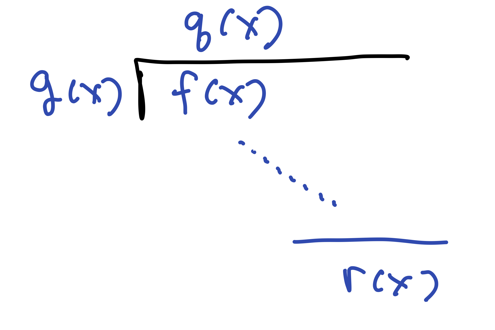

# Field Constructions

##  Polynomial Rings

Let $R$ be an integral domain, and consider the ring of polynomials in $R$ in one variable
$$
R[x] = \{ a_0 + a_1 x + a_2 x^2 + \cdots + a_n x^n \mid n \ge 0, a_i \in R\}
$$
The polynomial is a commutative ring with unity equal to the polynomial 1. There are no zero divisors, so $R[x]$ is an integral domain. We also have
$$
R \subseteq R[x]
$$
as the subring of scalar polynomials. The *units* in $R[x]$ are the units in $R$.

The **degree** of a polynomial $p(x) \in R[x]$ is the highest power of $x$ with a nonzero coefficient. For example,

* $\deg(3 x^5 + 2 x^3 - 11 x + 10) = 5$
* $\deg(7x -4 ) = 1$
* $\deg(13) = 0$
* $\deg(0) = -\infty$ (or, sometimes, it is said to b undefined).

Observe that
$$
(5 x^3 + 2 x - 11)(-2 x^4 + 3 x^3 -2x + 4) = -10 x^7 + 15 x^6  \cdots - 44.
$$
As we can see, if $R$ is an integral domain, then
$$
\deg(p(x)q(x)) = \deg(p(x))+\deg(q(x)).
$$

We are especially interested in the case where $R = \FF$ is a field. In that case we have a division algorithm, which is both an algorithm and a theorem:

**Theorem** (Division Algorithm) If $f(x), g(x) \in \FF[x]$ with $g(x) \not = 0$, then there exist *unique* polynomials $q(x),r(x) \in \FF[x]$ such that
$$
f(x)= g(x) q(x) + r(x), \qquad \hbox{with}\quad \deg(r(x)) < \deg(g(x)).
$$

The proof of this is to show that the algorithm for polynomial division that we learned in high school works, arrives at unique quotients and remainders, and ends with a remainder that is smaller than the degree of $g(x)$. The proof is by induction on the degree of $f(x)$.

{width=40%}
**Theorem** (Remainder Theorem) If $a \in \FF$ and $f(x) \in \FF[x]$ then $f(a)$ is the remainder after division of $f(x)$ by $(x-a)$.  That is,
$$
f(x) = (x-a)q(x) + f(a).
$$

**Theorem** (Factor Theorem) If $a \in \FF$ is a zero of $f(x)$; that is, if $f(a) = 0$, then $(x-a)$ is a factor of $f(x)$. Thus
$$
f(x) = (x-a)q(x) \qquad \Longleftrightarrow \qquad f(a) = 0.
$$

## Quotient Rings $\FF[x]/\langle p(x) \rangle$

**Def**: An integral domain $R$ is a **principal ideal domain** (PID) if *every* ideal is principal, i.e, $I = \langle a \rangle$ for $a \in R$.

The next theorem is a consequence of the division algorithm.

**Theorem** If $\FF$ is a field then $\FF[x]$ is a principal ideal domain. Moreover, if $I \subseteq \FF[x]$ is a nonzero ideal, then $I = \langle p(x) \rangle$ where $p(x) \in I$ is any nonzero polynomial of smallest degree in $I$.

**Theorem** (Remainders are Unique Coset Representatives) If 
$$
p(x) = b_0 + b_1 x + \cdots + b_n x^n \in \FF[x]
$$
then the following set is a set of distinct coset representatives for $\FF[x]/\langle p(x) \rangle$. That is, all of the cosets are represented exactly once in this set
$$
\frac{\FF[x]}{\langle p(x) \rangle} =
\{a_0 + a_1 x + \cdots a_{n-1} x^{n-1} + \langle p(x) \rangle \mid a_i \in \FF \}
$$
Moreover, the following coset identity describes multiplication in this quotient ring,
$$
x^{n} + \langle p(x) \rangle 
=
\frac{-1}{b_n}(b_0 + b_1 x + b_2 x^2 + \cdots b_{n-1} x^{n-1}) + \langle p(x) \rangle.
$$

**Theorem** If $\FF$ is a field and $p(x) \in \FF[x]$, then the following are equivalent:"

a. $p(x)$ is irreducible (i.e., it does not factor in $\FF[x]$ into a product of two polynomials each of lower degere).
b. $\langle p(x) \rangle \subseteq \FF[x]$ is a maximal ideal.
c. $\displaystyle{\FF[x]}{\angle p(x) \rangle}$ is a field.

The following theorem can be used to find inverses in $\FF[x]/\langle p(x) \rangle$ in the case when $p(x)$ is irreducible.

**Theorem** (Extended Polynomial Euclidean Algorithm) If $f(x), p(x) \in \FF[x]$ 