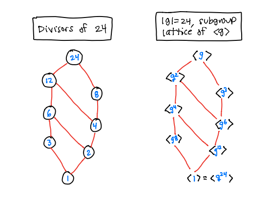

# Cyclic Groups


```{r,echo=FALSE,warning=FALSE}
require(pracma)
CyclicCayley <- function(n,op="+") {
  G = 0:(n-1)
  T = mod(outer(G,G,op),n)
  rownames(T) = G
  colnames(T) = G
  return(T) }
```
A group $\G$ is **cyclic** if $\G = \langle g \rangle$ for some $g \in \G$.

For example, $\ZZ = \langle 1 \rangle$ is an infinite cyclic group under addition, and $\ZZ_{n} = \{ 0, 1, 2, \ldots, n-1\} = \langle 1 \rangle$ is a cyclic group under addition mod $n$. 

Here is the Cayley table of $\ZZ_{10}$. See [Modular Arithmetic] for the R function that produces these tables for any value of $n$.


```{r,echo=TRUE}
CyclicCayley(10)
```


**Theorem.** (Fundamental Theorem of Cyclic Groups) If $\G = \langle g\rangle$, then


a.  Every subgroup $\H \le \G$ is cyclic (thus, $\H = \langle g^k \rangle$).

b.  If $|g| = \infty$ then $\langle g \rangle = \{ \ldots, g^{-3}, g^{-2}, g^{-1}, 1, g, g^2, g^3, \ldots \}$ and all of these elements are distinct. 

c.  If $|g| = n$ then $\langle g \rangle = \{1, g, g^2, \ldots, g^{n-1} \}$ and all of these elements are distinct (thus, $|g| = |\langle g \rangle|$).

d.  If $|g| = n$ then  the subgroups of $\langle g \rangle$ satisfy:


    i.  $\langle g^k \rangle = \langle g^d \rangle$, where $d = \gcd(k,n)$.

    ii.  $|\langle g^k \rangle| = \frac{n}{d}= \frac{n}{\gcd(k,n)}$, which is a divisor of $n$.

    iii. If $\ell \vert n$, then $|\langle g^{n/\ell} \rangle|$ is a subgroup of size $\ell$ and is the only subgroup of size $\ell$.

Note: (d) says that, in a finite cyclic group of order $n$, there is exactly one subgroup for each divisor of $n$ and those are all the subgroups.


<center>
{width=100%}
</center>

**Corollary** If $\G = \langle g \rangle$ is a finite cyclic group of order $n$. Then $\G = \langle g^k rangle$ if and only if $\gcd(k,n) = 1$. 

Thus, for example, the generators of $\ZZ_{10}$ above are

```{r,echo=TRUE}
Units(10)
```


Infinite cyclic groups:

1. Our favorite infinite cyclic group is the set of integers $\ZZ$ under addition. 

2. The subgroup $\langle \pi \rangle \le \RR^\ast$ is an infinite cyclic group
$$
\langle \pi \rangle = \{\ldots, \pi^{-3}, \pi^{-2}, \pi^{-1}, 1, \pi, \pi^2, \pi^3, \ldots \} \le \RR^\ast.
$$

3. See [Complex n-th roots of unity] for the infinite cyclic group $\langle 1.02 e^{2 \pi i /17} \rangle \le \CC^\ast$.

Some finite cyclic groups:

1. The [Complex n-th roots of unity]. 

2. The rotation group of an n-gon:
$$
R_n = \{1, r, r^2, \ldots, r^{n-1}\} \le \D_n
$$

3. Sometimes the group of units $U(n)$ under multiplication mod $n$ is cyclic. For example, here is a demonstration that  $U(21) = \langle 2 \rangle$. This is a cyclic group of order 18.

```{r,echo=TRUE}
Units(27)
mod(2^(0:18),27)
```

