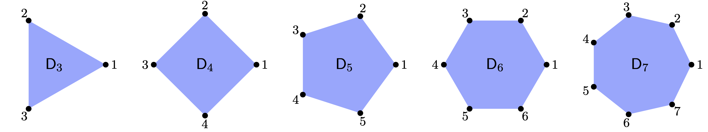

# Dihedral Groups

\usepackage{tikz}

For $n \ge 3$, the **dihedral group** $\D_n$ is the set of rigid symmetries of a regular $n$-sided polygon (an "$n$-gon").  For consistency, we will arrange our $n$-gon as points around the unit circle, with 1 at position (1,0) and the points ordered counter clockwise, as seen here. 

{width=85%}

Let $r$ be the rotation by $2 \pi/n$ counter-clockwise, and let $f$ be the reflection (flip) over the $x$-axis. Then $\D_n$ has the following $2n$ elements
$$
\D_n = \{1, r, r^2, \ldots, r^{n-1}, f, rf, r^2f, \ldots, r^{n-1}f\}.
$$
It is generated by $r$ and $f$ subject to the relations
$$
r^n = 1, \qquad f^2 = 1, \qquad f r = r^{-1} f = r^{n-1} f.
$$

The group is ***non-cyclic** and ***nonabelian**. The set of rotations
$$
R_n = \langle r \rangle = \{1, r, r^2, \ldots, r^{n-1}\}
$$
is a cyclic subgroup of order $n$. Since it is half the group it is a normal subgroup of index $[\D_n:R_n] = 2$.

The dihedral group $\D_n$ can be represented as a subgroup of the symmetric group $\S_n$ by identifying each the generators with the following permutations (in disjoint cycle notation):
$$
r = (1, 2, 3, \ldots, n), \qquad f = (2,n)(3,n-1)(4,n-2) \cdots.
$$
When $n = 3$, $\S_3 \cong \D_3$. Otherwise, for $n > 3$, $\D_n$ is a proper subgroup of $\S_n$.