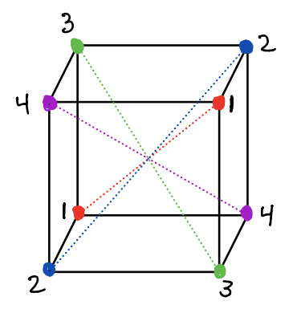

# Problem Set 2

\newcommand{\A}{{\mathsf{A}}}

**Due**: Friday April 2, 5:00PM CST. 

* You should upload your assignment on Moodle. 
* You can hand write your solutions and scan them, or typeset them in R or LaTex. But you should upload the assignment in a single PDF or a single HTML file. 
* Ideally, submit the problems in order, but if that is not possible, the problems should be clearly labeled.
* You should **justify** all answers, unless the assignment is to *compute* something. Then you should clearly display your computed work. 
* All assignments will be out of **30 points**. For example, this assignment has six 5-point problems. 
* **Late work**: assignments will be lowered by 10% each day they are late. The solution will be posted on Tuesday. From that point on, I will still accept assignment write-ups, but you can earn a maximum of half of the points.
* **Collaboration** is encouraged. In fact, it has been shown that people who form study groups, and talk about assignments, learn more and perform better. However, you should write up your own work in your own words (blatent copying is not acceptable), and if you receive substantial help from a classmate, you should give that person credit in your write-up (no pentalty for this!).

## Complex Roots of Unity.

Let $C_{12}$ be the group consisting of the 12 complex roots of $x^{12} - 1 = 0.$ 

a. Draw a picture of this group in the complex plane $\mathbb{C}^\ast$. Color in blue each of the points in this group which are generators of $C_{12}$.

b. Draw the subgroup lattice of $C_{12}$. 

c. Choose a color for each subgroup (the whole group is blue) and color the generators of each subgroup in your original picture. Each group element should get a color this way. You don't have to show any work. In your answer to part (a) all of the elements of the group should have a color and your answer to part (b) should indicate which color is associated with which subgroup.

c. Show that the *sum* of the elements of $C_{12}$ is 0. Do it as follows. We know that $x = 1$ is one of the roots of $x^{12} - 1$. Divide $(x-1)$ into $x^{12}-1$ using "old school" [polynomial long division](https://www.mathsisfun.com/algebra/polynomials-division-long.html). Use your resulting polynomial to answer the questions.

## Permutation Computations

a. The following permutation is given as a product of non-joint cycles in $\S_6$. Write it in disjoint cycle notation. 
$$
\sigma = (123456) (632)(134)(25) (316)
$$

b. Write the permutation below (a) in disjoint cycle notation, (b) as a product of transpositions, and (c) as a product of adjacent transpositions. Use fewer transpositions in your answer to (b) than you use in your answer for (c).
$$
\sigma = 
\begin{pmatrix} 
1 & 2 & 3 & 4 & 5 & 6 & 7 & 8 \\ 
4 & 8 & 2 & 1 & 7 & 5 & 6 & 3 \\
\end{pmatrix}
$$

c. The symmetric group $\S_6$ has 720 elements. How many of these elements have order 2? How many of these elements have order 4? Justify your answers.

c. The symmetric group $\S_{10}$ has 3.6 million elements in it. Find a permutation $\sigma \in \S_{10}$ of maximum order. Justify your answer. 

## Conjugate Subgroups

If $\H \le \G$ and $g \in \G$ define $g \H g^{-1} = \{ g h g^{-1} \mid h \in \H\}$. This is called the **conjugate** of $\H$ by $g$.

a. Prove that $g \H g^{-1}$ is a subgroup of $\G$.

b. In the dihedral group $D_4$ find the conjugate subgroup $g \H g^{-1}$ in the following two cases:

    (i) $\H = \{1, f\}$ and $g = r$.
    (ii) $\H = \{1, r^2, f, r^2 f\}$ and $g = r$.

c. In the symmetric group $S_4$ of permutations of $\{1,2,3,4\}$ let $\H = \{ \sigma \in S_4 \mid \sigma(3) = 3 \}$ be the subgroup that fixes 3. Compute $\alpha \H \alpha^{-1}$ if $\alpha = \begin{pmatrix} 1 & 2 & 3 & 4 \\ 4 & 3 & 1 & 2 \end{pmatrix}$. What do the permutations in $\alpha \H \alpha^{-1}$ have in common?

## Subgroup of Squares

In a group $\G$ define the *set* of squares to be
$K = \{ g^2 \mid g \in \G\}.$

a. Prove that if $\G$ is abelian, then $K \le \G$.

b. In $\A_4$ (the alternating group of even permutations in $\S_4$ discussed on Tuesday), find two permutations $a,b\in \A_4$ such that $a$ and $b$ are each squares (i.e., $a = x^2$ and $b = y^2$ for $x,y \in \A_4$) but $ab$ is not a square. This shows that if $G$ is nonabelian $K$ may not be a subgroup (this is the smallest group that exhibits this phenomenon).

## Half of a Subgroup

a. Prove that if $\H$ is a subgroup of $\S_n$ then either $\H \le \A_n$ or exactly half of $\H$ is even and half of $\H$ is odd. 

* **Hint**: If $\H$ has an element $\alpha$ of odd order, then define a map 
$$
\begin{array}{ccc}
\H &\to& \H \\
h & \mapsto & h \alpha \\
\end{array}
$$
Argue that the image of this map is $\H$? What does this map do to even elements? to odd elements?

b. Prove: If $\H \le \S_n$ has odd order, then $\H \le \A_n$.

## Symmetry group of the cube

The symmetric group $\S_4$ is isomorphic to the rotation group of a cube. There are four long diagonals of the cube. In the picture below, these diagonals connect the vertices labeled 1 to one another, the vertices labeled 2 to one another, the vertices labeled 3 to one another, and the vertices labeled 4 to one another.  (The diagonals are not drawn in this picture).

{width=30%}

The rotation corresponding to the permutation $\sigma \in \S_4$ permutes diagonal $i$ to diagonal $j$ if $\sigma(i) = j$. For example, the rotation corresponding to the 4-cycle $\sigma = (1,2,3,4)$ is shown here.

{width=75%}

Find the rotation corresponding to each of the permutations below (given below in cycle notation). For each of them, indicate the axes of rotation and the number of radians (and direction) that you rotate by, and give the before and after picture with the vertices labeled and colored as I have done above for $(1,2,3,4)$. 

a. $(1,2)$

b. $(1,2,3)$

c. $(1,2)(3,4)$

I recommend using a [paper model of the cube](https://www.mathsisfun.com/geometry/cube-model). 

## Extra Credit

(**2 pts**) Give, with proof, a formula for the number of permutations of cycle type $\mu = [\mu_1, \mu_2, \ldots, \mu_\ell]$.