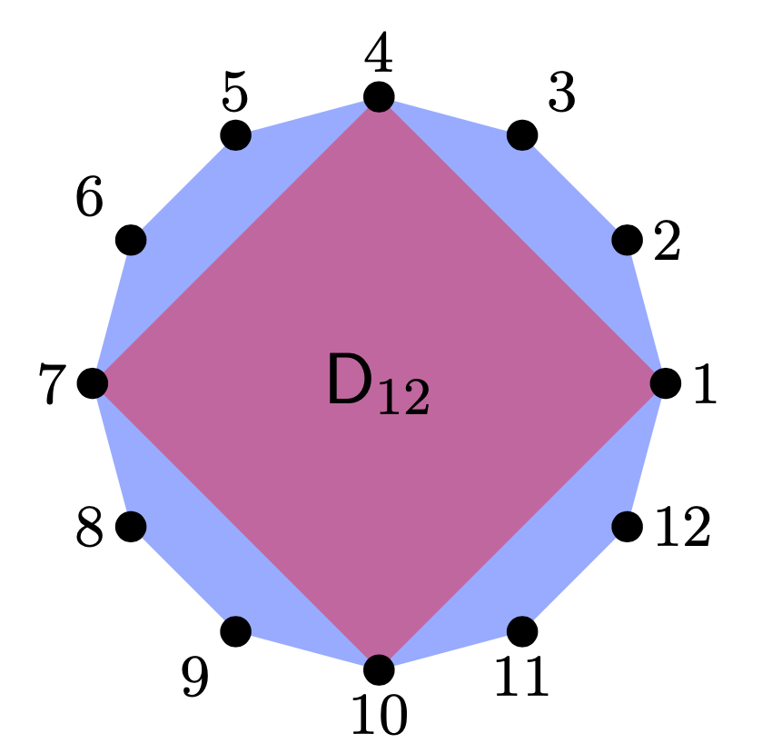

# Problem Set 3

**Due**: Friday April 9, 5:00PM CST. No penalty if turned in by **noon on Saturday**.  Same rules as previous assignments.

## Centralizer is a Group Invariant

Suppose that $\phi: \G_1 \to \G_2$ is a group isomorphism. Let $a \in \G_1$ and recall that the *centralizer* of $a$ in $\G_1$ is the subgroup
$$
C_{\G_1}(a) = \{ g \in \G_1 \mid g a = a g\} \le \G_1.
$$
Prove that $\phi(C_{\G_1}(a)) = C_{\G_2}(\phi(a))$.

Hint: for one of the directions I used the fact that $x a = a x$ if and only if $x a x^{-1} a^{-1} = e$.

## Dihedral Cosets

In this problem, we will work with the dihedral group $\D_{12}$ for the 12-gon pictured below. Per usual, let $r$ be rotation by $2 \pi/12$ counter-clockwise, and let $f$ be the flip over the horizontal axis. Then 
$$
\D_{12} = \{1, r, r^2, \ldots, r^{11}, f, r f, r^2 f, \ldots, r^{11} f\}.
$$
Let $\H \le \D_{12}$ be the subgroup that fixes the square below in the sense that the square has to go to the square (it can rotate or flip the square but it has to end up in the same place).

a. Find $\H$.
b. It makes sense that $\H \cong \D_4$ since it it rotates and flips the square. 
    i. Give an isomorphism $\phi: \D_4 \to \H$ (just state your isomorphism). Let $R$ and $F$ be the generators of $\D_4$ to distinguish them from the generators of $\D_{12}$.
    ii. Show that $\phi(R)^4 = 1$, $\phi(F)^2 = 1$, and $\phi(F)\phi(R) = \phi(R)^3 \phi(F)$. This proves that $\phi$ is an isomorphism, since these are the defining relations of $\D_4$.
    
c. Decompose $\D_{12}$ into left $\H$ cosets.
d. The elements of each coset share a common property related to the image. What is it?

{width=35%}

## Fermat's "Little" Theorem

The point of this problem is to show that some of the important properties of modular arithmetic and coding theory actually come from group theory. 

Recall that $U(n) = \{ 1 \le k < n \mid \gcd(k,n) = 1\}$ is the group of units under multiplication mod $n$. Let $\phi(n) = |U(n)|$, so that $\phi(n)$ is the number of positive integers less than $n$ that are relatively prime to $n$. 

a. Fill out the table
$$
\begin{array}{|c|ccccccccccc|}
\hline
n & 2 & 3 & 4 & 5 & 6 & 7 & 8 & 9 & 10 & 11 & 12 \\
\hline
\phi(n) & & &&&&&&&&& \\
\hline
\end{array}
$$

b. Prove that $a^{\phi(n)} \equiv 1  (\mathsf{mod}\ n)$. (Hint: use a corollary of Lagrange's Theorem).

c. Demonstrate that b works for $n = 12$ and each $a \in U(12)$.

d. Use part (b) to prove the following, which is called *Fermat's Little Theorem*: $a^{p} \equiv a (\mathsf{mod}\ p)$ for a prime number $p$.

e. Demonstrate Fermat's Little Theorem for $p = 7$ and each number in $U(7)$.

## Index of the Center

Prove that in a finite group $\G$, the index of the center $[G:Z(\G)]$ cannot be prime. (Hint: let $a \in \G \setminus Z(\G)$ and consider the centralizer $C_\G(a)$).

## Quaternion Quotient

Recall the quaternion group $Q_8 = \{1,-1,i,-i,j,-j,k,-k\}$. 

a. Show that $H = \{1,-1\}$ is a normal subgroup of $Q_8$.

a. The quotient group $Q_8/H$ has order 2. You have proved that, up to isomorphism, there are two groups of order 4. They are $\mathbb{Z}_4$ and the Klein-4 group $K_4 = \mathbb{Z}_2 \times \mathbb{Z}_2$. Which of these two groups is $Q_8/H$ isomorphic to?

## A Matrix Quotient

Let $\G$ and $\H$ be defined as below:
$$
\G = \left\{\begin{bmatrix} a & b \\ 0 & c \end{bmatrix} \mid a,b,c \in \RR, ac \not=0 \right\}
\hskip.5in
\H = \left\{\begin{bmatrix} 1 & d \\ 0 & 1 \end{bmatrix} \mid d \in \RR \right\}.
$$
Then $\G$ is a group under matrix multiplication (note: $ac$ is the determinant of the matrix so $ac \not = 0$ means that that the matrix is invertible).

a. Show that $\H \le \G$.
b. Show that $\H \trianglelefteq \G$.
c. Find a set $X$ that consists of exactly one matrix from each coset of $\G/\H$.

