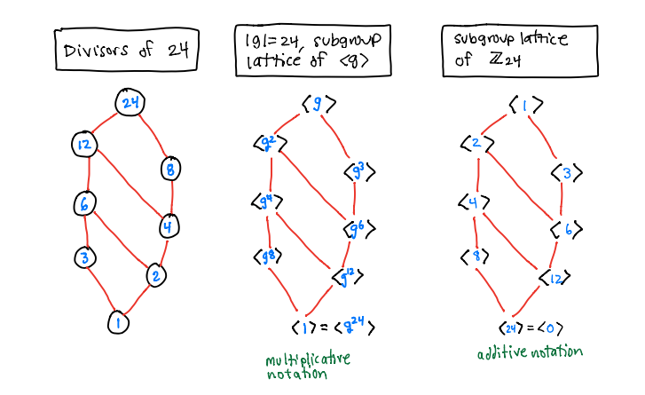

# Groups

## Groups

**Def**: A **group** is a set $\G$ with a binary operation $\ast$ that satisfies the following:

a. (Identity) There exists $e \in \G$ such that: if $g \in \G$, then  $e \ast g= g \ast e = g$.

b. (Inverse) If $g \in \G$, then there exists $g^{-1} \in \G$ so that $g \ast g^{-1} = g^{-1} \ast g = e$.

c. (Associativity) If $a,b,c \in \G$, then $(ab)c = a (bc)$. 

Furthermore, the group is **abelian** if it also satisfies the commutative property:

d. (Commutative) If $a,b \in \G$, then $ab = ba$.

**Proposition** (Uniqueness) Let $\G$ be a group. Then

a. $\G$ has a unique identity element $e$.

b. If $a,b,c \in \G$ and $ab = e$ and $ca = e$, then $a = c$.

b. If $g \in \G$ then t
here is a unique element $g^{-1}$ such that $g g^{-1} = g^{-1} g = e$.

**Proposition** (Cancellation) Let $\G$ be a group and $a,b,c \in \G$.

a. If $a b = a c$ then $b = c$.
b. If $b a = c a$ then $b = c$.

**Proposition** ($ax =b$) Let $\G$ be a group and $a,b \in \G$.

a. The equation $a x = b$ has a unique solution $x = a^{-1} b$.
b. The equation $x a = b$ has a unique solution $x = b a^{-1}$.

**Proposition** (Latin Square) Let $\G$ be a group and $a \in \G$.

a. The function $\G \to \G$ defined by left multiplication by $a$,  $g \mapsto a g$, is one-to-one and onto.
b. The function $\G \to \G$ defined by right multiplication by $a$,  $g \mapsto g a$, is one-to-one and onto.

## Subgroups

**Def**: A *subset* $\H \subseteq \G$ of a group $\G$ is a **subgroup** if $\H$ is a group under the same binary operation that it inherits from $\G$. We write $\H \le \G$ to denote that $\H$ is a subgroup of $\G$ and write $\H < \G$ if $\H \le \G$ and $\H \not= \G$.

**Theorem**: (Subgroup Test) A *nonempty* subset $\H \subseteq \G$ is a subgroup if

a. (identity) $e \in \H$, where $e$ is the identity in $\G$.
b. (closure) If $h_1, h_2 \in \H$, then $h_1 h_2 \in \H$.
c. (contains inverses) If $h \in \H$, then $h^{-1} \in \H$.

Note: (a) follows from (b) and (c).

**Def**: The **order** of an element $g \in \G$ is the smallest positive integer $m$ such that $g^m = e$, and we write $|g| = m$. If there is no such $m$, then $|g| = \infty$.

**Def**: The **center** of a group $\G$ is the following subgroup
$$
Z(\G) = \{ a \in \G \mid \hbox{ if $g \in \G$ then $ag  = ga$ } \}.
$$

**Def**: If $g \in \G$ then $\langle g \rangle$ is the smallest subgroup of $\G$ that contains $g$. It is called the **cyclic subgroup generated by** $g$. This subgroup contains all possible powers of $g$:
$$
\langle g \rangle = \{ g^k \mid k \in \ZZ \}.
$$

## Cyclic Groups

A group $\G$ is **cyclic** if $\G = \langle g \rangle$ for some $g \in \G$.

**Theorem.** (Fundamental Theorem of Cyclic Groups) If $\G = \langle g\rangle$, then

a.  Every subgroup $\H \le \G$ is cyclic (thus, $\H = \langle g^k \rangle$).

b.  If $|g| = \infty$ then $\langle g \rangle = \{ \ldots, g^{-3}, g^{-2}, g^{-1}, 1, g, g^2, g^3, \ldots \}$ and all of these elements are distinct. 

c.  If $|g| = n$ then $\langle g \rangle = \{1, g, g^2, \ldots, g^{n-1} \}$ and all of these elements are distinct (thus, $|g| = |\langle g \rangle|$).

d.  If $|g| = n$ then  the subgroups of $\langle g \rangle$ satisfy:

    i.  $\langle g^k \rangle = \langle g^d \rangle$, where $d = \gcd(k,n)$.

    ii.  $|\langle g^k \rangle| = \frac{n}{d}= \frac{n}{\gcd(k,n)}$, which is a divisor of $n$.

    iii. If $\ell \vert n$, then $|\langle g^{n/\ell} \rangle|$ is a subgroup of size $\ell$ and is the only subgroup of size $\ell$.

Note: (d) says that, in a finite cyclic group of order $n$, there is exactly one subgroup for each divisor of $n$ and those are all the subgroups.

{width=70%}

